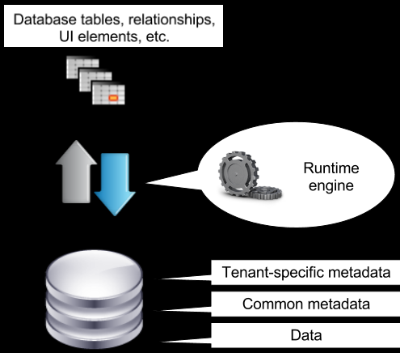
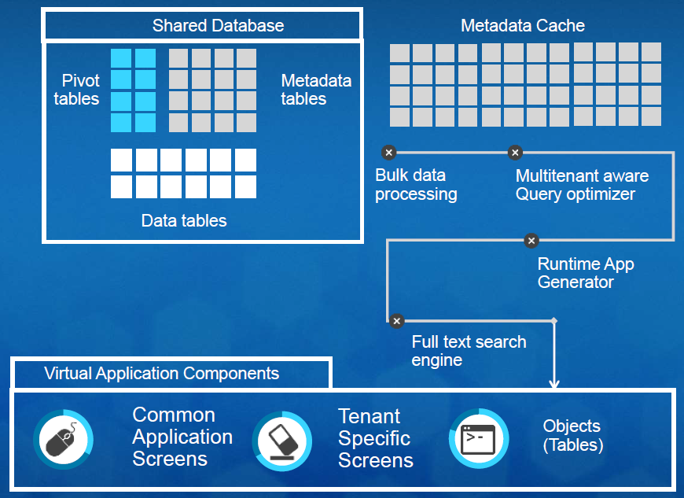
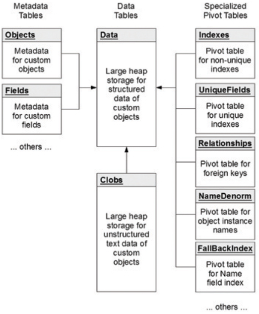

## Multitenant Architecture

- Multi-tenancy is an architecture style in which a single instance of a software application serves multiple customers. Each customer is called a **tenant**.
- The challenge in this architectural pattern is to keep tenant-specific data secure in a shared database so that one tenant can’t see another tenant’s data.
- Force.com is a modern Platform as a Service (PaaS) that’s built for cloud computing, with multitenancy inherent in its design.
- Force.com address Multi-tenancy challenges by keeping distinction between
  - Compiled runtime database engine (kernel),
  - Tenant data and
  - The metadata that describes each application.
    
- Architecture Style

  - Salesforce has one Primary Data Store per Production Instance. Each Instance stores 8k+ customer/tenant data.
  - All the customer data segregated by **Org ID**.
  - At the heart of Force.com uses **Oracle DB** as its **Shared database transaction engine**.
  - Force.com also employs **Apache Solar** as a search engine that optimizes **Full text indexing and searches**. As applications update data, the search service’s background processes asynchronously update tenant and user-specific indexes in near real time.
  - Each page is Salesforce is rendered real-time based on the metadata stored.
    
  - Recipe of the Magic

    - Each table is called as **SF Object**.
    - Salesforce does not create tables on the fly but stores all the data in a single table. Its storage model manages virtual database structures using a set of metadata, data, and pivot tables.
    - All the metadata on creation of new Objects, fields, stored procedures and database triggers are stored in **Universal Data Dictionary (UDD)**. The system’s engine will use this data to generate the virtual application components at runtime.
    - Force.com uses massive and sophisticated metadata caches to maintain the most recently used metadata in memory, avoid performance-sapping disk I/O and code recompilations, and improve application response times.
    - Table Structure

      - **MT_Objects**: It stores metadata about the tables that an organization defines for an application. Contains below fields
        - ObjID: Object ID
        - OrgID: Organization ID
        - ObjName: Object Name
      - **MT_Fields**: It stores metadata about the fields (columns) that an organization defines for each object
        - FieldID: Field ID
        - OrgID: Organization ID
        - ObjID: Object ID
        - FieldName: Field Name
        - FieldDataType: Field Data Type
        - IsIndexed: Boolean value to indicate if the field requires indexing
        - FieldNum: The position of the field in the object relative to other fields
      - **MT_Data**: It stores the application data that maps to all organization specific tables and their fields defined by metadata in MT_Objects and MT_Fields.
        - GUID: Global unique identifier
        - OrgID: Organization ID
        - ObjID: Object ID
        - Value: Stores Value0 ... Value500 flex columns, otherwise known as slots, store application data that maps to the tables and fields declared in MT_Objects and MT_Fields, respectively. All flex columns use a variable-length string datatype so that they can store any structured type of application data (strings, numbers, dates, etc.).
        - CreatedDate: Creation Date
        - CreatedBy: Created User Code
        - LastModifiedDate: Last Modified Date
        - LastModifiedBy: Last Modified User Code
        - IsDeleted: Indicate that a row has been deleted
      - **MT_Clobs**: Force.com also supports the declaration of fields as character large objects (CLOBs) to permit the storage of long text fields of up to 32,000 characters. This table is used to store each row CLOB data of MT_Data.
      - **MT_Indexes**: This table contains three columns for StringValue, NumValue, and DateValue. Whenever Index of column is required in MT_Data, system will will aslo store the value in the table and index the data. MT_Indexes are standard and non-unique database indexes.  
        Force.com can handle searches across multiple languages because the system uses a **case-folding algorithm** that converts string values to a universal, case-insensitive format. This value is stored in the StringValue column.
        - OrgID: Organization ID
        - ObjID: Object ID
        - FieldNum: The position of the field in the object relative to other fields
        - GUID: Global unique identifier
        - StringValue: String Value
        - NumValue: Number Value
        - DateValue: Date Value
      - **MT*Unique* Indexes**: This table is very similar to the MT*Indexes table, except that the underlying native database indexes of MT_Unique* Indexes enforce uniqueness.
        - OrgID: Organization ID
        - ObjID: Object ID
        - FieldNum: The position of the field in the object relative to other fields
        - GUID: Global unique identifier
        - StringValue: String Value
        - NumValue: Number Value
        - DateValue: Date Value
      - **MT_Fallback_Indexes**: When Force.com’s external search engine may not be able to respond to a search request in a timely manner then system will fallback to a secondary search mechanism to furnish reasonable search results.
        - A fall-back search is implemented as a direct database query.
        - To optimize global object searches Force.com maintains a MT_Fallback_Indexes pivot table that records the **Name of all records**.
        - Updates to MT_Fallback_Indexes happen synchronously as transactions modify records so that fall-back searches always have access to the most current database information.
      - **MT_Name_Denorm**: When an application needs to provide a list of records involved in a parent/child relationship, Force.com uses the MT_Name_Denorm table to execute a relatively simple query that retrieves the Name of each referenced record for display in the app, say, as part of a hyperlink.
        - ObjID: Object ID
        - Name: Name of each record
      - **MT_Relationships**: This table is used to declare relationships among application objects. When field is marked as relation then system will store ObjID in the Value field in the MT_Data table.
        - OrgID: Organization ID
        - ObjID: Object ID
        - GUID: Global unique identifier
        - RelationID: Relationship ID
        - TargetObjID: Target Object ID

      
