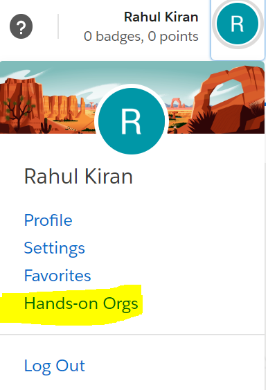
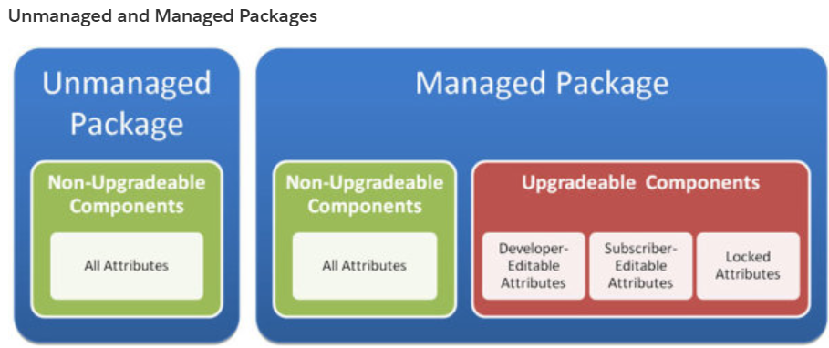
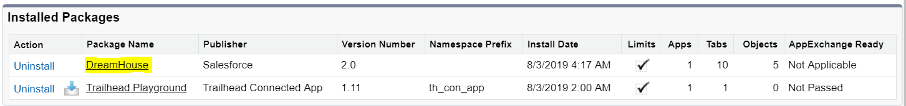
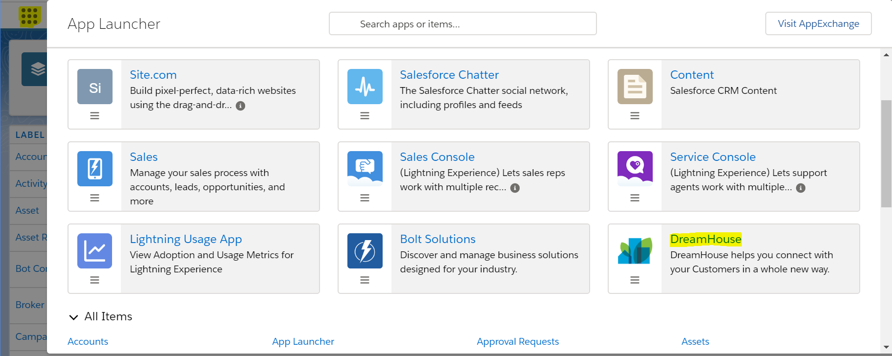

## Trailhead Playground

- To learn a software we require a learning path and acknowledgement of completion. Salesforce uses Trailhead to accomplish this task. Trailhead at high-level is below terminologies
  - **Trailblazer** are pioneers, innovators, and lifelong learners.
  - **Ohana** are made up of employees, customers, partners, and communities. These are united by a mutual desire to live Salesforce’s core values: trust, growth, innovation and equality.
  - **Trails** are groups of modules that provide guided learning paths suited to specific roles or needs.
  - **Modules** are all the organized learning topics. On completion of module we earn **badge**.
  - **Units** are broken small parts of modules. On completion of units we earn **points**.
  - **Project** are also used to earn points and badges. A project lays out step-by-step instructions for you to follow, then validates that you did everything correctly.
  - **Trailmix** are custom learning paths created from with favorite trails. These guides can be shared with fellow Trailblazers.
  - **Super badges** are unlike modules and projects which helps you to learn across an entire feature area by providing a real-life business scenario for which you have to build a solution.
- To learn any software we also require to install and then try to read documentation and experiment on the installed software. To resolve this problem, Salesforce use Trailhead Playground.
- A Trailhead Playground is an org you can use to complete hands on challenges, and try out new features and customizations.
- Every live Salesforce implementation has a Production org and a Developer Edition (DE) org . DE org is used to trying out new Salesforce features and playing around in a development environment.
- A Trailhead Playground is like a DE org, but specifically for Trailhead. This org comes with Trailhead-specific data, and a pre-installed unmanaged package that we use to test your hands-on challenges

---

### Creating Trailhead Org

- Navigate to [Trailhead](https://trailhead.salesforce.com) and create a Trailhead Account.
- On successful login into Trailhead, Salesforce will automatically create Trailhead Playground for individuals. To login to your org, Navigate to **Profile Icon -> Hands On Orgs** as given below 
- Trailhead Playground will be of URL **https://domainname.lightning.force.com**. Do not change domain name for your Trailhead Playground. This may deactivate your account.

---

### Resting Password [Dont not change]

- You can reset user password by navigating into **Setup -> Users [Table] -> Profile with System Administrator**. Select the checkbox and click on reset password, and email will be sent the reset password.
- Clicking on user hyperlink and change password will ask for a security question and this will not allow to change password for the first time.

---

### Installing Dream House App

- Salesforce has a community of partners that use the flexibility of the Salesforce platform to build amazing apps that anyone can use.
- A **package** is a container for something as small as an individual component or as large as a set of related apps. After creating a package, you can distribute it to other Salesforce users and organizations, including outside your company.
- A **component** is one constituent part of a package. It defines an item, such as a custom object or a custom field. You can combine components in a package to produce powerful features or applications.
- There are two types of packages

  - **Unmanaged:**

    - Unmanaged packages are typically used to distribute open-source projects or application templates to provide developers with the basic building blocks for an application.
    - You can customize code and metadata, if desired.
    - The developer who created and uploaded the unmanaged package has no control over the installed components, and can't change or upgrade them.
    - Install an unmanaged package only if the org used to upload the package still exists.
    - To receive an upgrade, you must uninstall the package from your org and then reinstall a new version from AppExchange.
    - The contents of the package don’t count against the app, tab, and object limits in your org.

  - **Managed:**

    - Managed packages are typically used by Salesforce partners to distribute and sell applications to customers.
    - You can’t view or change the offering’s code or metadata.
    - These packages must be created from a Developer Edition organization.
    - Using the AppExchange and the License Management Application (LMA), developers can sell and manage user-based licenses to the app.
    - Managed packages are also fully upgradeable.
    - Some components can be upgraded while others can’t.
    - The contents of the package don’t count against the app, tab, and object limits in your org.

  

- To install **DreamHouse**, navigate to https://domainname.lightning.force.com/packagingSetupUI/ipLanding.app?apvId=04tB00000009UeX and click install.
- Heroku App is available [here](https://ty-dreamhouse-web-app.herokuapp.com/)
- To check if app is installed successfully Navigate to **Profile Icon -> Setup -> PLATFORM TOOLS -> Apps -> Packaging -> Installed Packages**
  

---

### Open Dream House App

- Open **DreamHouse** application installed using AppLauncher.
- Navigate to **Settings -> Setup -> PLATFORM TOOLS -> Objects and Fields -> Object Manager**
  

### References

- [Understanding Packages](https://help.salesforce.com/articleView?id=sharing_apps.htm&type=5)
