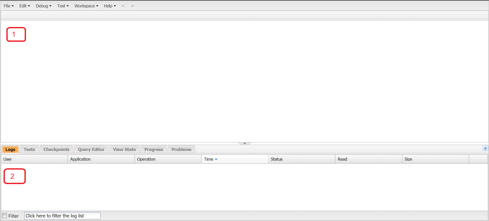

## Developer Environment

### VSCode

- Login to [Salesforce developer portal](https://developer.salesforce.com/) and create an Account.
- Install VSCode Extension [Salesforce Extension Pack](https://marketplace.visualstudio.com/items?itemName=salesforce.salesforcedx-vscode).
- Install [Salesforce CLI](https://developer.salesforce.com/docs/atlas.en-us.sfdx_setup.meta/sfdx_setup) to simplify development and build automation when working with your Salesforce org. To confirm successful installation type `sfdx` in command prompt.
- Creating a hello-world project
  - Goto Command Pallet (Control + Shift +P) and type **SFDX: Create project with Manifest**.
  - Enter the Project Name **MyDevOrg**.
  - In the popup create a new folder **01-HelloWorld**.
  - Check if file **manifest -> package.xml** is available.
  - Goto Command Pallet (Control + Shift +P) and type **SFDX: Authorize an Org**.
  - Enter the Org as **MyDevOrg**. This will navigate to [SFLogin](https://login.salesforce.com). Once logged in successfully you should be able to see **exit code 0** in VSCode terminal.
  - Navigate to **manifest -> package.xml** and **Right Click -> SFDX: Retrieve Source from Org**.
  - Create a folder **tools** with blank file **tempApex.input** at the root of th folder to avoid execution error.
  - Goto Command Pallet (Control + Shift +P) and type **SFDX: Create Apex Class** and enter class name as **hello**.
  - Copy below code.
    ```java
    public class hello {
        public static void sayHello() {
            System.debug('Hello World');
        }
    }
    ```
  - Select the line `System.debug('Hello World');` code and goto Command Pallet (Control + Shift +P) and type **SFDX: Execute Anonymous Apex with Editor Contents**.
  - Navigate to **manifest -> package.xml** and **Right Click -> SFDX: Deploy Source to Org** to upload Apex class to Salesforce.
  - You should be able to view this code in `Setup -> Developer Console -> File -> Open Resources -> hello.apxc`.

---

### Developer Console

- The Developer Console is an integrated development environment (more typically called an IDE) where you can create, debug, and test apps in your org.
- Force.com IDE is an eclipse based plugin that can also be used to connect to multiple orgs, compare or synchronize files, or use version control.
- When you open the Developer Console for the first time we see two things:
  - The main pane is the source code editor, where you can write, view, and modify your code.
  - The tabs pane is where you can view logs, errors, and other information, and write queries to interact with the records in your org.
    
- If you’re working on two different projects, Developer Console supports creating Workspaces. Workspaces reduce clutter and make it easier to navigate between different resources. Select **Workspace -> New Workspace** and give your workspace a name.
- Some features of Developer Console
  - Creating Source Code
    - Apex:
      - Create: **File -> New -> Apex Class** and **File -> Save**
      - View: **File -> Open -> Classes**
      - Execute: **Debug -> Open Execute Anonymous Window -> Execute**
    - Aura Component:
      - Create: **File -> New -> Lightning Component** and **File -> Save**
      - View: **File -> Open Lightning Resources**
    - Visualforce:
      - Create: **File -> New -> Visualforce Page**, **File -> Save** and In the top left corner, click **Preview**.
      - View: **File -> Open -> Pages**
  - Logging
    - All the logs generated using System.debug are available in Developer Console -> Logs tab.
    - All the logs are categorized into two types
      - ApexCode: This logs events related to Apex code and includes information about the start and end of an Apex method.
      - Database: This includes logs related to database events, including Database Manipulation Language (DML), SOSL, and SOQL queries.
    - Salesforce provides different Logs levels as given below. You can set these levels by selecting **Debug -> Change Log Levels**.
      - NONE
      - ERROR
      - WARN
      - INFO
      - DEBUG
      - FINE
      - FINER
      - FINEST
    - Execute Apex code in **Debug -> Open Execute Anonymous Window**, an new log file will be created. Double click the log file to read the content. This data can be filtered based on
      - This Frame:
      - Executable:
      - Debug only: Display only USER_DEBUG events.
      - Filter : Check this and Enter a method name or any other text you are specifically looking for, and the log filters your results.
    - Raw logs can also be obtained using **File -> Open -> Open Raw Logs**
    - You can also have advanced parsing of logs using **Debug -> View Log Panel**. This has below details functionalities:
      - Stack Tree: Displays log entries within the hierarchy of their objects and their execution using a top-down tree view.
      - Execution Stack: Displays a bottom-up view of the selected item.
      - Execution Log: Displays every action that occurred during the execution of your code.
      - Source: Displays the contents of the source file, indicating the line of code being run when the selected log entry was generated.
      - Source Lis: Displays the context of the code being executed when the event was logged.
      - Variables: Displays the variables and their assigned values that were in scope when the code that generated the selected log entry was run.
      - Execution Overview: Displays statistics for the code being executed, including the execution time and heap size.
  - Checkpoint
    - Checkpoints show you snapshots of what’s happening in your Apex code at particular points during execution.
    - Checkpoints aren’t available for Visualforce markup.
    - To enable check points navigate to apex source code , you can see line numbers on the left side. Click the line number to be inspected; A red dot appears, indicating that a checkpoint has been created. Save to code with this checkpoint.
    - Execute Apex code in **Debug -> Open Execute Anonymous Window**. Snap shot of checkpoint will be available in Checkpoints tab. Check points are categorized into two types
      - **Heap:** Displays all objects present in memory at the line of code where your checkpoint was executed.
      - **Symbols:** This is a quick and simple way to review the states of various objects at any checkpoint.
