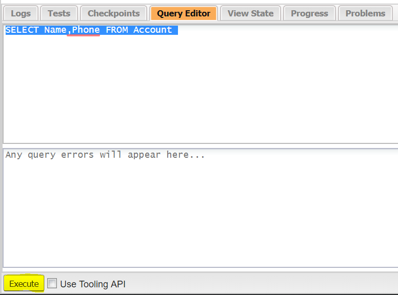
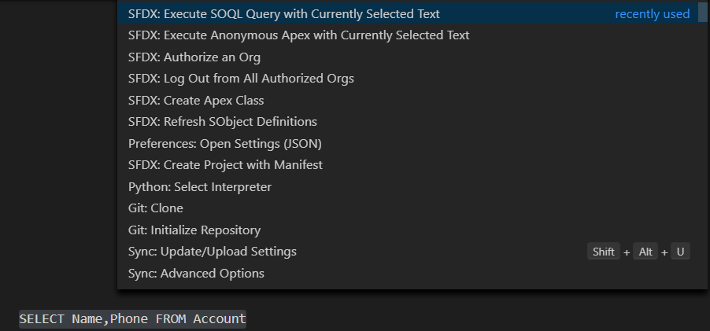

## Data Model

- Data model is a way to model what database tables look like in a way that makes sense to humans.
- In Salesforce, Database **tables** are known as **objects**, **columns** as **fields** and **rows** as **records**.
- Salesforce supports several different types of objects

  - **Standard objects:**
    - These objects are included with Salesforce and used by its CRM software.
    - You can also customize standard objects by adding custom fields.
  - **Custom objects:**
    - These objects are created by implementation team to store information that’s specific to your company or industry or implementation.
    - On creating a custom object, the platform automatically builds things like the page layout for the user interface.
    - All custom fields and tables API names are suffixed with `__c`.
  - Salesforce supports different field/column data types as given below.

    | Data Type                    | Description                                                                                                                                                                                                                                                      |
    | ---------------------------- | ---------------------------------------------------------------------------------------------------------------------------------------------------------------------------------------------------------------------------------------------------------------- |
    | Auto Number                  | A system-generated sequence number that uses a display format you define. The number is automatically incremented for each new record.                                                                                                                           |
    | Formula                      | A read-only field that derives its value from a formula expression you define. The formula field is updated when any of the source fields change.                                                                                                                |
    | Roll-Up Summary              | A read-only field that displays the sum, minimum, or maximum value of a field in a related list or the record count of all records listed in a related list.                                                                                                     |
    | Lookup Relationship          | Creates a relationship that links this object to another object. The relationship field allows users to click on a lookup icon to select a value from a popup list. The other object is the source of the values in the list.                                    |
    | External Lookup Relationship | Creates a relationship that links this object to an external object whose data is stored outside the Salesforce org.                                                                                                                                             |
    | Checkbox                     | Allows users to select a True (checked) or False (unchecked) value.                                                                                                                                                                                              |
    | Currency                     | Allows users to enter a dollar or other currency amount and automatically formats the field as a currency amount. This can be useful if you export data to Excel or another spreadsheet.                                                                         |
    | Date                         | Allows users to enter a date or pick a date from a popup calendar.                                                                                                                                                                                               |
    | Date/Time                    | Allows users to enter a date and time, or pick a date from a popup calendar. When users click a date in the popup, that date and the current time are entered into the Date/Time field.                                                                          |
    | Email                        | Allows users to enter an email address, which is validated to ensure proper format. If this field is specified for a contact or lead, users can choose the address when clicking Send an Email. Note that custom email addresses cannot be used for mass emails. |
    | Geolocation                  | Allows users to define locations. Includes latitude and longitude components, and can be used to calculate distance.                                                                                                                                             |
    | Number                       | Allows users to enter any number. Leading zeros are removed.                                                                                                                                                                                                     |
    | Percent                      | Allows users to enter a percentage number, for example, '10' and automatically adds the percent sign to the number.                                                                                                                                              |
    | Phone                        | Allows users to enter any phone number. Automatically formats it as a phone number.                                                                                                                                                                              |
    | Picklist                     | Allows users to select a value from a list you define.                                                                                                                                                                                                           |
    | Picklist (Multi-Select)      | Allows users to select multiple values from a list you define.                                                                                                                                                                                                   |
    | Text                         | Allows users to enter any combination of letters and numbers.                                                                                                                                                                                                    |
    | Text Area                    | Allows users to enter up to 255 characters on separate lines.                                                                                                                                                                                                    |
    | Text Area (Long)             | Allows users to enter up to 131,072 characters on separate lines.                                                                                                                                                                                                |
    | Text Area (Rich)             | Allows users to enter formatted text, add images and links. Up to 131,072 characters on separate lines.                                                                                                                                                          |
    | Text (Encrypted)             | Allows users to enter any combination of letters and numbers and store them in encrypted form.                                                                                                                                                                   |
    | Time                         | Allows users to enter a local time. For example, "2:40 PM", "14:40", "14:40:00", and "14:40:50.600" are all valid times for this field.                                                                                                                          |
    | URL                          | Allows users to enter any valid website address. When users click on the field, the URL will open in a separate browser window.                                                                                                                                  |

---

### Setup Menu

- There are three main categories in the Setup menu

  - **Administration:** You can manage your users and data and do things like add users, change permissions, import and export data, and create email templates.
  - **Platform Tools:** You do most of your customization in Platform Tools like view and manage your data model, create apps, modify the user interface, and deploy new features to your users and manage your code as well.
  - **Settings:** You manage your company information and org security like add business hours, change your locale, and view your org’s history.

---

### Creating a Custom Object

- Create a new table/object with below and click on Save
  - Create: Custom Object
    - Label: Property
    - Plural Label: Properties
    - Launch New Custom Tab Wizard after saving this custom object: Checked
  - Add Field to Property Custom Object with below and click on Save
    - Select Property Object
    - Click on Fields & Relationships
      - Create New
      - Data Type: Currency
      - Field Label: Price
      - Description: The listed sale price of the home
      - Required: Checked

---

### SOQL

- Salesforce provides the Salesforce Object Query Language [SOQL] to read a record from Salesforce Object. SOQL is similar to the standard SQL language but is customized.
- Because Apex has direct access to Salesforce records that are stored in the database, you can embed SOQL queries in your Apex code and get results in a straightforward fashion. When SOQL is embedded in Apex, it is referred to as **inline SOQL**.
- To include SOQL queries within your Apex code, wrap the SOQL statement within square brackets and assign the return value to an array of sObjects.  
  `Account[] accts = [SELECT Name,Phone FROM Account];`
- Unlike other SQL languages, you can’t specify `*` for all fields. You must specify every field you want to get explicitly.
- A `WHERE` clause is used to limit the records to be returned that fulfilled the conditions.
- Operator & Wildcards

  | Operator | Description                                                                                  |
  | -------- | -------------------------------------------------------------------------------------------- |
  | =        | Exact Match Comparison Operator                                                              |
  | %        | Pattern Match Comparison Operator. % and \_ wildcards will be used to determine the pattern. |
  | AND      | Displays records if all the conditions separated by AND are TRUE                             |
  | OR       | Displays records if at-least one conditions separated by OR are TRUE                         |

  <br>

  | Wildcards | Description                  |
  | --------- | ---------------------------- |
  | %         | Match one or more characters |
  | \_        | Match one character          |

- Apex code variables can be replaced in SOQL queries using bind variables
  ```java
  String targetDepartment = 'Wingo';
  Contact[] techContacts = [SELECT FirstName,LastName
                          FROM Contact WHERE Department=:targetDepartment];
  ```
- We can use `ORDER BY` clause to choose the sort order of the returned record sets. We can specify a specific field by which the records should be sorted.The default sort order is in alphabetical order, specified as ASC
  ```sql
  SELECT Name,Phone FROM Account ORDER BY Name ASC
  SELECT Name,Phone FROM Account ORDER BY Name DESC
  ```
- You can limit the number of records returned to an arbitrary number by adding the `LIMIT n` clause where `n` is the number of records you want returned.  
  `SELECT Name,Phone FROM Account LIMIT 1`
- For bulk processing of records, SOQL for loop can be used. This fetch 200 sObjects for one loop. This will help to avoid reaching governor limits.
  ```java
  for (variable_list : [soql_query]) {
    code_block
  }
  ```
- There are two ways to run SOQL Queries
  - Developer Console -> Query Editor -> Execute
    
  - VSCode -> Select SOQL Query -> Execute SOQL Query with Currently Selected Text
    

---

### SOSL

- SOSL [Salesforce Object Search Language ] is used search fields across multiple standard and custom object records in Salesforce.  
  `FIND 'SearchQuery' [IN SearchGroup] [RETURNING ObjectsAndFields]`
  - SearchQuery
    - It is the text to search for.
    - Search terms can be grouped with logical operators (AND, OR) and parentheses.
    - Search terms can include wildcard characters (\*, ?).
      - \* represents zero or more characters at the middle or end of the search term.
      - ? represents only one character at the middle or end of the search term.
  - SearchGroup
    - It is optional.
    - It indicates scope of the fields to search.
    - If not specified, the default search scope is all fields. Its contains following values
      - ALL FIELDS
      - NAME FIELDS
      - EMAIL FIELDS
      - PHONE FIELDS
      - SIDEBAR FIELDS
  - ObjectsAndFields
    - It is optional.
    - It indicates information to return in the search result. A list of one or more sObjects and, within each sObject, list of one or more fields, with optional values to filter against.
    - If not specified, the search results contain the IDs of all objects found.
    - You can filter, reorder, and limit the returned results of a SOSL query.  
      `RETURNING Account(Name, Industry WHERE Industry='Apparel')`  
      `RETURNING Account(Name, Industry ORDER BY Name)`  
      `RETURNING Account(Name, Industry LIMIT 10)`
- Similar to SOQL you also can embed SOSL queries directly in your Apex code. When SOSL is embedded in Apex, it is referred to as **inline SOSL**.
- Unlike SOQL, which can only query one standard or custom object at a time, a single SOSL query can search all objects.
- SOSL matches fields based on a word match and not exact match. For example, searching for 'Digital' in SOSL returns records whose field values are 'Digital' or 'The Digital Company'.

  ```java
  //In Apex, search string should be in ''
  List<List<sObject>> searchList = [FIND 'Wingo OR SFDC' IN ALL FIELDS
                   RETURNING Account(Name),Contact(FirstName,LastName,Department)];
  Account[] searchAccounts = (Account[])searchList[0];
  Contact[] searchContacts = (Contact[])searchList[1];
  System.debug('Found the following accounts.');
  for (Account a : searchAccounts) {
      System.debug(a.Name);
  }
  System.debug('Found the following contacts.');
  for (Contact c : searchContacts) {
      System.debug(c.LastName + ', ' + c.FirstName);
  }

  //In Query Editor, search string should be in {}
  FIND {Wingo} IN ALL FIELDS RETURNING Account(Name), Contact(FirstName,LastName,Department)
  ```
