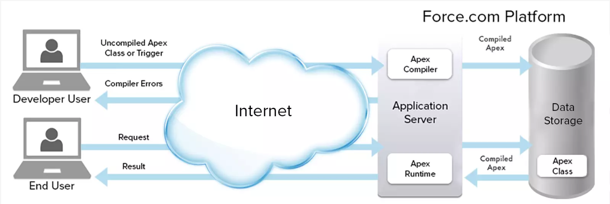

## Apex

### Overview

- It is a proprietary programming language provided by the Force.com platform to developers similar to Java and C# and acts like database stored procedures.
  
- Apex features
  - Object oriented.
  - Does not provide multi-threading interfaces for developers but uses multi-threading for language implementation features.
  - Supports versioning of custom code.
  - It is a case-insensitive language. Exceptions are:
    - Set values and Map keys
    - Salesforce Record ID
    - Most String methods
  - Adds a new `global` access access modifier. This allows access across namespaces and applications.
  - Database statements
    - Query languages to query and search data.
    - Support DML operations
    - Transactions and rollbacks.
    - Support Triggers, which are similar to triggers in database systems.
- Apex code can be written
  - In the cloud (your Salesforce org) : **Setup -> Developer Console**
  - Can be saved locally and synced automatically to the cloud : **SFDX + VSCode**

---

### Comments

- Single line comments
  ```java
  //This comment will be ignored when the code is run.
  Integer i = 1;
  ```
- Multiline Comments

  ```java
  /*
   This comment is
   ignored when the
   code runs
  */

  Integer i = 1;
  ```

---

### Syntax

- Apex statements end with a semicolon.

---

### Variables

- A variable is a container for data. You can give it a name to describe what’s in it. You can also add things to the container based on the data type.
- Primitive Data Types  
  |Type | Description|
  |--- | ---|
  |Integer | A positive or negative 32 bit number that doesn’t have a decimal point.|
  |Long | This is a 64-bit number without a decimal point.|
  |Decimal | A positive or negative number that has a decimal point.|
  |Double | This is a 64-bit number that includes a decimal point.|
  |String | A series of characters surrounded by single quotes. This can include any text as short as one letter to sentences.|
  |Boolean | Typically either true or false. In Apex, null (empty) is also a valid value. Boolean is commonly used with checkboxes.|
  |Record ID | Salesforce record Id uniquely identifies each record in Salesforcce. Salesforce record Id can either be 15 digit (case-sensitive version & referenced in UI) or 18 digit.|
  |enum | A typed list of values|
  |Date | This can only store the date and not the time.|
  |Datetime | This can only store the date and time.|
  |Time | This variable is used to store the particular time. his variable should always be declared with the system static method.|
  |Blob | A collection of binary data stored as a single object. Used for documents.|
  |Object | Any data type that is supported in Apex. All Apex data types inherit from Object.|
- Apex is a strongly-typed language, meaning that each time you declare (create) a variable, you set its data type, its name, and optionally, its initial value.
- Default value of a variable is **null**

---

### Collections

- A collection is a type of variable that can store multiple items. There are three types of Apex collections:

  - Lists

    - It is an ordered group of items of the same type.
    - Can store duplicate values.
    - Order of storing data is recorded.
    - Arrays in Apex are basically the same as Lists in Apex.
    - There is no logical distinction between the Arrays and Lists as their internal data structure and methods are also same but the array syntax is little traditional like Java.
    - `ListException` is raised if there are any problem with a list, such as attempting to access an index that is out of bounds.

    ```java
    //Array with size notation.
    //arrayOfProducts can grow with .add()
    String [] arrayOfProducts = new String[3];

    //Array With List Notation
    String [] arrayOfProducts = new List<String>();

    //List with not defaul values
    List<String> groceries = new List<String>();
    groceries.add('Tea');

    // Creating with default value
    List<String> groceries = new List<String>{'Tea'};
    groceries.add(1, 'Milk');
    System.debug(groceries.get(0));
    ```

  - Sets

    - An unordered group of unique items of the same type.
    - If you try to add an element that’s already in the set, you don’t get an error, but the new value is not added to the set.

    ```java
    Set<String> teaTypes = new Set <String>{'Black', 'White', 'Herbal'};
    teaTypes.add('Green');
    System.debug(teaTypes.get(0));
    ```

  - Maps

    - A collection of key-value pairs. Each unique key maps to a single value.
    - Keys and values can be any data type.
    - Although each key is unique, values can be repeated within a map.

    ```java
    Map <String, String> teaTypes = new Map <String, String>();
    teaTypes.put('Black', 'Earthy');
    System.debug(teaTypes.get('Black'));
    ```

---

### Operators

- List of Apex Operators
  Operator | Description
  --- | ---
  `+` | Concatenation Operator `'The variable numberOfSpoons is: ' + numberOfSpoons`
  `=` | Assignment operator
  `<` | Less than
  `<=` | Less than or equal to
  `==` | Equal to
  `!=` | Not equal to
  `<>` | Not equal to
  `>` | Greater than
  `>=` | Greater than or equal to
  `&&` | Logical AND operator
  `||` | Logical OR operator

---

### Control Flow

- If
  ```java
  if(condition){
    statements;
  } else if(condition){
    statements;
  } else{
    statements;
  }
  ```
- Switch
  ```java
  switch on waterLevel{
    when condition{
      statements;
    }
    when else{
      statements;
    }
  }
  ```

---

### Loops

- while
  ```java
  while (condition){
      statements;`
  }
  ```
- do-while
  ```java
  do{
    statements;
  }while (condition)
  ```
- for

  ```java
  //Traditional For Loop
  for(Integer i = 0; i < 5; i++){
    System.debug('The number is ' + i );
  }

  // List or Set Iteration For Loops
  List <String> tea = new List<String>{'Black Tea', 'Green Tea', 'Chai Tea'};
  for(String t : tea){
      System.debug('We have ' + t);
  }
  ```

---

### Exception Handling

- Exceptions note errors and other events that disrupt the normal flow of code execution.
- Apex uses `try`, `catch` and `finally` statements to handle exceptions. Below are the list of built-in exceptions:

  - DmlException
  - ListException
  - NullPointerException
  - QueryException
  - SObjectException

  ```java
  try {
    List<Integer> li = new List<Integer>();
    li.add(15);
    // This list contains only one element,
    // but we're attempting to access the second element
    // from this zero-based list.
    Integer i1 = li[0];
    Integer i2 = li[1]; // Causes a ListException
  } catch(ListException le) {
    System.debug('The following exception has occurred: ' + le.getMessage());
  }
  ```

- A throw statement is used to signal that an error has occurred.  
  `throw exceptionObject;`
- You can create custom exceptions to throw in your methods. To create your custom exception class, extend the built-in Exception class and make sure your class name ends with the word Exception.  
  `public class MyException extends Exception {}`

---

### sObject

- It is an Apex data type that corresponds to a Salesforce object (sObject) in an org.
- It is a complex data type that hold a single record of data from a Salesforce object, such as an Account, a Contact, or an Opportunity.
- Fields of sObject are called sObject properties.

  ```java
  Account myAcct = new Account();
  myAcct.Name = 'The Tea Factory';
  myAcct.Phone= '555-0129';
  myAcct.AccountNumber = '356281';
  ```

- To perform DML operations apex code uses `insert`, `update`, `upsert`, `undelete`, `delete` and `merge` statements. These work with single or List based sObject records.
- Fields on related records can't be updated with the same call to the DML operation and require a separate DML call.
- The `delete` operation supports cascading deletions. If you delete a parent object, you delete its children automatically, as long as each child record can be deleted.
- The `upsert` operation creates new records and updates sObject records within a single statement. The statement matches the sObjects with existing records by comparing values of one field. Upsert statement uses the sObject record's primary key (the ID), an idLookup field, or an external ID field to determine whether it should create a new record or update an existing one.
- The `merge` operation merges up to three records of the same sObject type into one of the records, deleting the others, and re-parenting any related records.
- **sObject** variables can be reused to perform further DML operations, such as updates, as the system will be able to map the sObject variable to its corresponding record by matching the ID.
- Salesforce has limit of **150 DML statements per Apex transaction**. This can be overcome by performing operations using list of sObjects. Each list of sObjects transaction will be considered as an single transaction.
- Deleted records aren’t deleted permanently from Lightning Platform, but they’re placed in the **Recycle Bin for 15 days** from where they can be restored.
- If a DML operation fails, it returns an exception of type `DmlException`.

  ```java
  //Single records
  insert myAcct;

  //Multi record
  List<Account> myAccts = new List<Account>();
  insert myAccts;

  //Assigning variables using SOQL
  Contact[] contactsDel = [SELECT Id FROM Contact WHERE LastName='Smith'];

  // Create the account sObject
  Account acct = new Account(Name='Acme', Phone='(415)555-1212', NumberOfEmployees=100)  ;
  // Insert the account by using DML
  insert acct;
  // Get the new ID on the inserted sObject argument
  ID acctID = acct.Id;
  // Display this ID in the debug log
  System.debug('ID = ' + acctID);
  // Debug log result (the ID will be different in your case)
  // DEBUG|ID = 001D000000JmKkeIAF
  ```

---

### Database Class

- This class provides methods that perform DML operations. Below methods are static.
  - `Database.insert()`
  - `Database.update()`
  - `Database.upsert()`
  - `Database.delete()`
  - `Database.undelete()`
  - `Database.merge()`
- Unlike DML statements, Database methods have an optional allOrNone parameter.
  - When this parameter is set to **false**, if errors occurs on a partial set of records, the successful records will be committed and errors will be returned for the failed records.
  - When this parameter is set to **true**, it behaves like its DML statement counterpart and will throw an exception if a failure is encountered.
  ```java
  // Bulk insert all contacts with one DML call
  Database.SaveResult[] srList = Database.insert(conList, false);
  // Iterate through each returned result
  for (Database.SaveResult sr : srList) {
      if (sr.isSuccess()) {
          // Operation was successful, so get the ID of the record that was processed
          System.debug('Successfully inserted contact. Contact ID: ' + sr.getId());
      } else {
          // Operation failed, so get all errors
          for(Database.Error err : sr.getErrors()) {
              System.debug('The following error has occurred.');
              System.debug(err.getStatusCode() + ': ' + err.getMessage());
              System.debug('Contact fields that affected this error: ' + err.getFields  ());
  	 }
      }
  }
  //Upsert returns Database.UpsertResult objects, and delete returns Database.DeleteResult objects.
  ```

---

### System Features

- Development:
  - Use the **Developer Console**, click **Debug** | **Open Execute Anonymous Window**. To run Anonymous sample code
- Classes n Methods
  - Developers use `System.debug` to monitor changing values in an effort to pinpoint where their code goes awry.  
    `System.debug('Hello World');`
  - Below are the three assert methods in system class
    - `System.assert(condition, msg):` Asserts if a specified condition is true. If it is not true, a fatal error returned that causes code execution to halt.
    - `System.assertEquals(expected, actual, msg):` Asserts if the first two arguments are the same. If it is not true, a fatal error returned that causes code execution to halt.
    - `System.assertNotEquals(expected, actual, msg):` Asserts if the first two arguments are not same. If it is true, a fatal error returned that causes code execution to halt.
