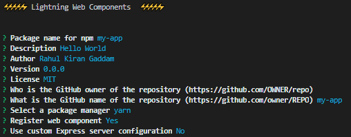
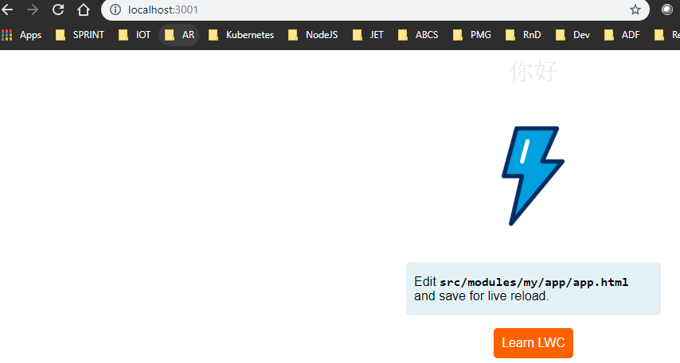

## Lightning Web Components

### Overview

- In this section we will go through one of the UI development model highlighted below of Salesforce.com.
  - Visual Force
  - Lightning Components: We can build build Lightning components using two programming models as given below. Both these models can coexist and interoperable on a Salesforce page.
    - Aura Components:
      - As of March 2019, this component development is marked as read-only as Salesforce has archived.
      - The reason for this is, aura component does not follows W3C standards for developing components. Its has Salesforce proprietary recipes to create Web Components.
      - This require resources to know Salesforce specific development model. This makes harder to get resources in the market.
    - **Lightning Web Components**
      - These components are also referred as **LWC**.
      - These are based on W3C specifications with minimal Salesforce proprietary recipes like project layout, web components, directives etc..
      - Salesforce has also opensourced [LWC](https://lwc.dev). This has everything except Salesforce proprietary web components.

#### Web Components

- Web Components are used define Custom Elements that allow developers to implement reusable components with only HTML, CSS and JavaScript.
- Advantages of Web Components
  - WebComponents are based on below:
    - **HTML Templates:**
      - These are used to hold HTML tags without displaying.
      - The content can be made visible and rendered later by using JavaScript.
      - The **\<template\>** and **\<slot\>** elements enable developers to write markup templates that are not displayed in the rendered page.
    - **Custom Elements:**
      - Allows developers to create HTML native developer specific elements.
      - Developer can perform all native activities on these elements like attributes, properties and methods.
    - **Shadow DOM:**
      - This is different from Virtual DOM.
      - Address DOM encapsulation problem by allowing custom elements to have its on DOM Subtree.
      - These are rendered separately from parent DOM to prevent collision of script and styling.
  - These components are framework independent and can be used in any framework like React, Angular, Oracle JET etc..
  - Cross functional teams can create a UI components based on companies style guide.

#### Lightning Web Components Opensource

- To understand LWC, lets start working with bare bones LWC Opensource.
- To work with LWC, we require below:

  - Node.js (LTS 10.15 version is used in this demo)
  - Navigate to your preferred folder and run below commands

    ```script
    npm i -g yarn
    npm i -g lwc-create-app
    cd D:\01-MyDev\01-Salesforce\01-LWC\00-Demo
    lwc-create-app my-app
    cd my-app
    yarn watch

    ```

    

  - Open browser http://localhost:3001, this will display below Salesforce hello scaffolding app.
    

- Building blocks of LWC

  - HelloWorld

    - Navigate to `scr/modules` and create a new folder `learn/hello`
    - Create new files `hello.hmtl` and `hello.js` as below

      ```html
      <template>
        Hello, {name}
      </template>
      ```

      ```javascript
      import { LightningElement, api } from "lwc";

      export default class hello extends LightningElement {
        @api name = "World!";
      }
      ```

    - Update `src/index.html` and `src/index.js` with below

      ```html
      <!DOCTYPE html>
      <html lang="en">
        <head>
          <meta charset="utf-8" />
          <title>Hello World</title>
          <meta name="viewport" content="width=device-width,initial-scale=1" />
          <link rel="shortcut icon" href="/resources/favicon.ico" />
        </head>
        <body>
          <learn-hello></learn-hello>
        </body>
      </html>
      ```

      ```javascript
      import { buildCustomElementConstructor } from "lwc";
      import LearnHello from "learn/hello";

      customElements.define(
        "learn-hello",
        buildCustomElementConstructor(LearnHello)
      );
      ```

    - Delete folder `scr/modules/my`
