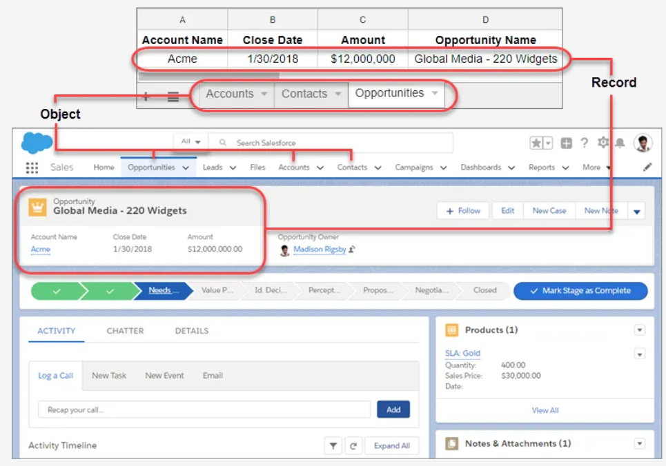
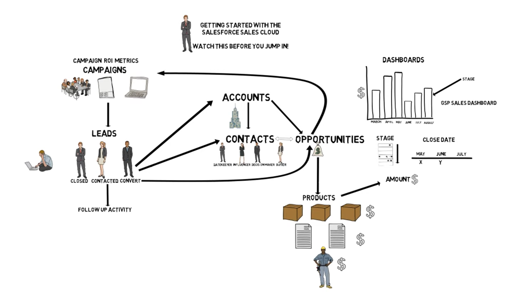

## CRM

### Overview
- CRM (Customer Relationship Management) allows to manage relationships with customers and prospects and track data related to all of your interactions.
- It also helps teams collaborate, both internally and externally, gather insights from social media, track important metrics, and communicate via email, phone, social, and other channels.

### Data Storage
- Salesforce organizes data as Objects and Records. 
- Comparing to excel `Objects` are like `Tabs` & `Records` are like `Rows`
    

    | Reference    	| Description                                                                            	|
    |--------------	|----------------------------------------------------------------------------------------	|
    | Organization 	| Instance of Salesforce. Used to isolate all customizations, data & configurations      	|
    | App          	| A set of fields, objects, permissions, and functionality to support a business process 	|
    | Object       	| A table in the database                                                                	|
    | Fields       	| Column                                                                                 	|
    | Record       	| Row                                                                                    	|
- Salesforce comes with a set of standard objects already set up and ready for use.

    | Object        	| Description                                                                                                                           	|
    |---------------	|---------------------------------------------------------------------------------------------------------------------------------------	|
    | Accounts      	| Companies we are doing business with                                                                                                  	|
    | Contacts      	| Customer of companies product and services                                                                                                 	|
    | Leads         	| Potential prospects who are ready to buy or product to be identified                                                                  	|
    | Opportunities 	| Qualified leads that converted to customers. Conversion of the Lead creates an Account and Contact along with the Opportunity. 	|

    