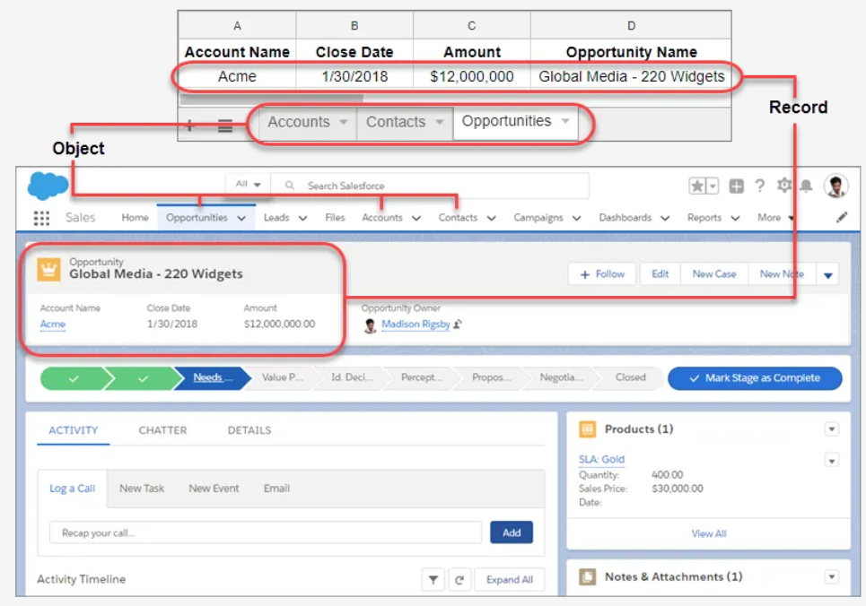

## CRM

### Overview
- CRM (Customer Relationship Management) allows to manage relationships with customers and prospects and track data related to all of your interactions.
- It also helps teams collaborate, both internally and externally, gather insights from social media, track important metrics, and communicate via email, phone, social, and other channels.

### Fundamentals
- Salesforce organizes data as Objects and Records. 
- Comparing to excel `Objects` are like `Tabs` & `Records` are like `Rows`
