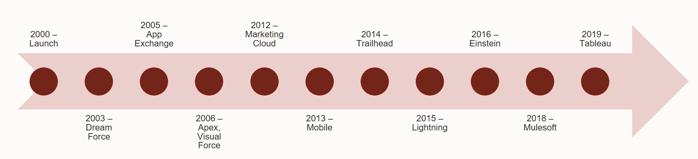

# Salesforce.com

## Table of Content

- [Overview](#Overview)
- [History](#History)
- [Modules](#Modules)
- [Appendix](#Appendix)

## Overview

- Salesforce is a Customer Relationship Management (CRM) solution that brings companies and customers together. As of 2017 Annual Report there are more than 150,000 Salesforce customers.
- Before Salesforce, CRM solutions were hosted on a company’s own server. This was a time talking process. Salesforce started with an idea of building an affordable CRM software and delivering it entirely online as a service (Software as a Service - SaaS).
- Salesforce also provides various software solutions and a platform for users and developers to develop and distribute custom software.
- Salesforce.com is based on multi-tenant architecture. This means that multiple customers share common technology and all run on the latest release. You don’t have to worry about the application or infrastructure upgrades – they happen automatically.
- Every year Salesforce provide three releases called Winter, Spring and Summer.

---

## History

- Salesforce started life in **March, 1999** contained out of a one bedroom apartment next to **Marc Benioff’s house**, a top **Telegraph Hill, San Francisco**.
- The three men that started working in this tiny office along with Marc; **Parker Harris, Frank Dominguez and Dave Moellenhoff**. They were also accompanied by posters of the **Dalai Lama, Albert Einstein and two Dogs**.
- Fast forward to **July, 1999** when Marc went full time at Salesforce.com, his first task was to find an office that was as scalable as his software. Marc landed on an office at the **Rincon Center**, it had eight thousand square feet, but with only **10 employees**, Parker was concerned.
- By **November 1999** there were desks in hallways, people working full time in conference rooms, and by **November 2000**, it was time for a move to **One Market Street**.
- As the millennium came around, Salesforce were armed with a great product, a great team and a new office at One Market Street. It was time for the product launch. Salesforce stood for something very different, and compared to the behemoth of other industry giants, Salesforce were a tiny fish in a huge pond, they had to stand out.
- Year **2003** was the birth of one of the most iconic parts of the Salesforce ecosystem. Prior to this, Salesforce had held many events around the country called **City Tours**, these usually lasted for a few hours and showcased the latest Salesforce features and roadmap, as well as allowed customers to network and talk about how to get more out of the product.
- This new event was called **Dreamforce**, and instead of lasting for a few hours, it was held over **a few days**. The first Dreamforce was held in downtown **San Francisco at a hotel called Westin St**. Francis and had just over 1000 registered attendees coming to the event with 52 presentations. **Dreamforce** was used to launch a product called **Sforce 2.0**.
- You may have just only heard about the **Salesforce Ohana**, with a recent push to involve not just the employee’s of Salesforce, but the global community they have created. **Hawaiian themed launch party** for **Salesforce.com** going public in **June 2004**. Hawaii was also what inspired Marc to purchase that **first office in the Rincon Centre**.
- In **2005 Salesforce developed a service** that would change business software forever, BusinessWeek called it **eBay for business software** and **Forbes** described it as the **iTunes of business software**, **Salesforce** called this service the **AppExchange**.
- At **Dreamforce 2006**, more than 5,000 members of the Salesforce community gathered to hear about the latest innovations at **Salesforce.com**. **Apex was Salesforce’s On-Demand Programming Language** which allows third parties, for the first time, to write and run code on **Salesforce.com’s multi-tenant, shared architecture**.
- But Salesforce didn’t stop there, **Parker Harris** developed a technology called **Visualforce** that allowed for users to create any user interface they wanted, they could build forms, buttons, links and embed anything they liked. This paved the way for the logical extension of the **Salesforce SaaS platform, Platform-as-a-Service**. They called it **Force.com** and it was released at **Dreamforce 2008**.
- **Radian 6 a social listening tool** was acquired for $326M, Buddy Media which specializes in publishing and analyzing social media content for $745M and finally ExactTarget which contained a variety of media marketing tools, for a grand price of $2.5B. These three acquisitions stood at a total of nearly $3.6B and formed the basis for the **Salesforce Marketing Cloud**. This was presented at the **Dreamforce 2012 keynote** and was supported by a 92,000 strong audience along with MC Hammer.
- In **2013** Salesforce rolled out the **Salesforce1 platform**, with the goal to open up access to as much information that you can access on a computer. This not only let you access your favorite Salesforce Apps, but **custom applications and integrations**, as well as AppExchange Apps that you may have downloaded from the App store.
- Salesforce’s look and feel has stayed relatively consistent for it’s **16 years in operation**. It has kept its **original Amazon style tabs** along with a white/blue color scheme. The **Lightning experience** new was slowly rolled out to the community over summer **2015** with an official launch at Dreamforce a couple of months later. The Lightning experience looked to change the way Salesforce.com looked through a browser forever. This would also unify the look and feel across Salesforce no matter what device you were using. Salesforce1 would later come into be the look and feel for the entire Salesforce platform called, Lightning.
- In **2016 Dreamforce**, Salesforce announced their newest product, **Einstein**. It delivers advanced AI capabilities to sales, service and marketing. It even allows developers to build Apps using the Einstein engine behind it.
- In **MAY 29, 2019**, Salesforce announced their newest product, **Blockchain**. It is a a low-code platform that enables organizations to share verified, distributed data sets across a trusted network of partners and third parties.
  

---

## Modules
- Functional Modules
  
- Technical Modules
  - **Force.com:** It allows admins and developers to create websites and applications into the main Salesforce.com application.
    - [Multitenant Architecture](./02-Modules/01-Force.com/01-MultiTenant.md)
    - [Trailhead](./02-Modules/01-Force.com/02-TrailheadPlayground.md)
    - [Developer Environment](./02-Modules/01-Force.com/03-DeveloperEnvironment.md)
    - [AppExchange](./02-Modules/01-Force.com/04-AppExchange.md)
    - [Data Model](./02-Modules/01-Force.com/05-DataModel.md)
    - [Apex](./02-Modules/01-Force.com/06-Apex.md)
    - [Reports]()
    - [Visualforce]()
    - [Lightning Web Components](./02-Modules/01-Force.com/09-Lightning.md)
    - [Workflows]()
    - [Process Builder]()
    - [Security]()
  - **Lightning Platform:** It is also known as Force.com and is a platform as a service (PaaS) that allows developers to create add-on applications that integrate into the main Salesforce.com application.
  - **Lightning:** It includes the Lightning Component Framework and some exciting tools for developers that makes it easier to build responsive applications for any device. Salesforce mobile app and Salesforce Lightning Experience are built with Lightning components.
    - Lightning components use client-side JavaScript controllers and server-side Apex controllers.
    - Another great thing about Lightning components is that they’re mobile-ready.
  - **Visualforce:** It is a Markup Language (Tag based language) similar to HTML and XML that contains Components(tags) and Controllers.
  - **Salesforce1:** It is the platform which enables you to develop application and exchange data via Application Programming Interface (APIs).
  - **Heroku:** It gives developers the flexibility to create apps using their preferred languages and tools.
  - **Salesforce Thunder:** It is a big data and rules processing engine designed to analyze events and take personalized actions.
  - **Chatter:** It is an enterprise collaboration platform from Salesforce that enables your employees to collaborate.
  - **Einstein:** It provides AI capabilities to Force.com platform. It learns from the data to deliver predictions and recommendations based on your unique business processes.
  - **Blockchain:** It provides a distributed digital ledger used for sharing information, buy and sell things, and verify the authenticity of information we rely on every single day.

---

## Appendix

- Reference
  - [MyProfile](https://trailblazer.me/id/rgaddam18)
  - [Salesforce Evolution](http://www.salesforceben.com/brief-history-salesforce-com/)
  - [Salesforce on VSCode](https://forcedotcom.github.io/salesforcedx-vscode/articles/getting-started/install)
  - [Trailhead](https://trailhead.salesforce.com/en/home)
  - [Architecture](https://developer.salesforce.com/developer-centers/architecture/)
  - [Salesforce Instance](https://trust.salesforce.com)
  - [AppExchange](https://appexchange.salesforce.com/)
  - [IdeExchange](https://success.salesforce.com/ideaSearch)
  - [Help](https://help.salesforce.com/home)
  - [Certifications](https://certification.salesforce.com/)
  - [Partners](https://partners.salesforce.com/)
